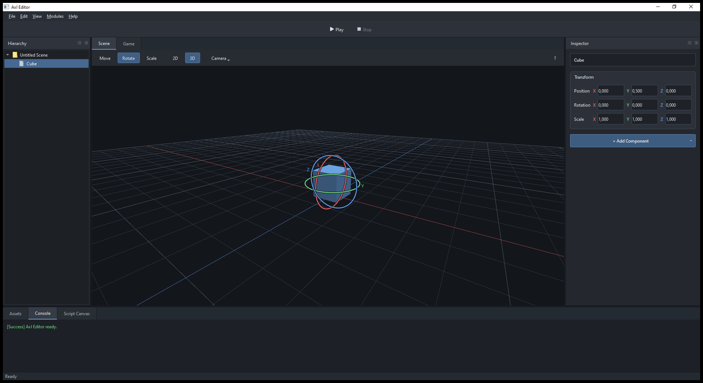

# Axl Editor

A small, extensible editor built with C++17 and Qt Widgets. Axl brings together
scene selection, an Inspector, a 2D/3D viewport and independent editor tools,
with replaceable providers for engine-specific data.



## Features

- Dockable Hierarchy, Inspector, Assets and Console panels, with saved window layouts.
- Scene and Game tabs; Game currently displays a placeholder.
- One viewport with perspective 3D and orthographic XY modes, a grid, reference cubes
  and Move / Rotate / Scale gizmos.
- Live Transform editing through the Inspector and viewport handles.
- Optional Comment and Asset Link properties with extensible Inspector sections.
- Project folders, versioned scene documents, atomic Save/Open and unsaved-change prompts.
- Separate scene and graph Undo/Redo histories, including one step per drag/scrub.
- Viewport picking, Frame Selected, Hierarchy search and F2 rename.
- Provider-based asset search, type filtering, a metadata picker, image preview and document opening.
- Console messages for information, warnings, errors and success.
- Console command input, history and scoped registration from any C++ class.
- A Python Console tool with persistent Python sessions, script files and 44 editor automation commands.
- A separate Script Canvas tool with Start/Print nodes, execution pins and Bezier connections.
- A minimal dark theme and a centered Play/Stop toolbar.

This is an editor prototype. Play/Stop are disabled and Game explains that runtime
execution is unavailable. Script Canvas edits and saves graphs but does not execute them.
The reference viewport draws cubes rather than implementing a production renderer.

## Build on Windows

Requirements:

- Qt 6.12 or newer, with the `msvc2022_64` desktop kit and Qt SVG module.
- Visual Studio with the **Desktop development with C++** workload.
- CMake 3.22 or newer and Ninja available in `PATH`.
- An OpenGL 3.3-capable graphics driver for the reference viewport.

From PowerShell in the repository root:

```powershell
.\build.ps1 -QtRoot 'C:\Qt\6.12.0\msvc2022_64' -Run
```

The script initializes the MSVC environment, builds a Release executable with Ninja
and deploys the Qt runtime into `build/`. Omit `-Run` to build without launching.
Without `-QtRoot`, it uses `.tools/Qt/6.12.0/msvc2022_64`.

### Startup arguments

```powershell
.\build\AxlEditor.exe --create-project 'D:\Projects\My Game'
.\build\AxlEditor.exe --open-project 'D:\Projects\My Game'
.\build\AxlEditor.exe --open-scene 'D:\Projects\My Game\Assets\main.axl'
.\build\AxlEditor.exe --open-project 'D:\Projects\My Game' --open-scene 'Assets/main.axl'
```

Creating a project makes a new directory with an empty `Assets/` folder and opens
an untitled scene. Existing destinations are rejected without overwriting files.
Project paths are resolved against the working directory; a relative scene path
uses the specified project directory, or the working directory when no project
argument is supplied. Quote paths containing spaces. A scene can be opened on
its own without selecting a project. Project creation/opening happens before
scene opening regardless of option order; the two project options are mutually
exclusive. Scene data is validated before folders or the current session change.
`--help` and `--version` print usage/version and exit. Invalid arguments, missing
paths or invalid scenes print an error and exit with code 2 without opening the
editor window. A normal launch and a clean application close use exit code 0.

Use **File -> Open Project** to select a folder. The reference browser scans its
`Assets/` subfolder recursively; a missing/empty folder is supported. Try the
included `Example/` project and open `Assets/example.axl` and `Assets/flow.axlgraph`.
The browser recognizes these extensions:

| Type | Extensions |
| --- | --- |
| Texture | `.png`, `.jpg` |
| Mesh | `.obj`, `.glb` |
| Scene | `.axl`, `.json` |
| Script | `.lua` |
| Graph | `.axlgraph` |
| Unknown | All other files |

Use **Refresh** to rescan and the search/type controls to filter metadata.
Double-click a Texture for an image preview, a Scene to open the scene document,
or a Graph to open Script Canvas. Other types log their metadata.
Opening handlers can be registered through `AssetOpenHandlers`; the general UI
never assumes a resource is a local file.

## Editor controls

Select an object in **Hierarchy** to edit its name and Transform in **Inspector**.
Select **Move**, **Rotate** or **Scale** in the Scene toolbar. Move uses world-axis
arrows; Rotate uses colored rings for local Euler components; Scale uses local-axis
square handles. The center square scales uniformly while preserving proportions.
In 2D mode, Move/Scale use X/Y and Rotate uses Z. Uniform 2D scale leaves Z unchanged.
Axis scale changes one component additively, allowing zero scales to be restored.
Negative scales are supported. Handles account for parent transforms; manipulation
is disabled under a singular parent transform. Escape cancels a drag and restores
its starting Transform. Loss of focus commits the last preview as one history step.
Transform fields have colored X/Y/Z labels on their left. Drag a label horizontally
to change its value, or type a number directly into the field.
Use **+ Add Component** to add a Comment or an Asset Link; each reference object
supports one of each. Asset Link opens a provider-based picker and stores a path
relative to the project, retaining missing links for later repair.
The Comment icon appears in the Add Component menu and the Comment section header.
Component SVGs live in `resources/icons/components/` and are embedded via Qt resources.

| Input | 3D mode | 2D mode |
| --- | --- | --- |
| Right mouse button + mouse | Rotate the camera | Pan the camera |
| WASD while the viewport has focus | Move the camera | Pan in XY |
| Mouse wheel | Change movement speed | Zoom |
| Left-drag a tool handle | Move/Rotate/Scale X, Y or Z | Move/Scale X/Y, Rotate Z |
| Left-click / empty space | Select / deselect a cube | Select / deselect a cube |
| F | Frame the selected cube | Frame the selected cube |
| Escape | Cancel a drag or stop navigation | Cancel a drag or stop navigation |

The compact Scene toolbar contains **2D / 3D**, camera speed settings and a **?**
control reference. **View -> Refresh Scene** (`F5`) pulls external scene changes.
Window geometry and dock layout are saved on close in `editor-layout.ini` beside
the executable. **View -> Save Layout** and **Reset Layout** are also available.

### Script Canvas

Open **Tools -> Script Canvas**, then right-click the canvas and choose
**Add Node -> Start** or **Print**. Nodes can be selected, dragged and deleted.
With the default layout, Script Canvas opens as a separate floating window.
Drag its title bar to dock it in the editor; the dock title bar retains its
undock button so it can be detached again. The saved layout remembers your choice.
Use **View -> Reset Layout** to restore the floating default if an older layout
has Script Canvas docked at the bottom.
Drag an output execution pin to an input pin to create a connection; select a
connection and press **Delete** to remove it. **Escape** cancels a pending connection.

Each execution input accepts one incoming connection. Outputs may connect to
multiple inputs. Invalid directions, occupied inputs, duplicate connections and
unsupported pin types are rejected without replacing existing connections.
Deleting a node removes its pins and incident connections.

The model and widget support multiple pins per node, with separate rows on each
side. The menu still creates only the two simple node types with one pin each.
The tool toolbar provides **New / Open / Save**. Graph documents use `.axlgraph`.
Save (`Ctrl+S`), Save As and Undo/Redo route to the document containing the focused
editor; graph edits never enter the scene history. Close checks both dirty documents.
After restarting, open the saved graph to restore nodes, pin IDs, wires and positions.

### Python Console

Open **Tools -> Python Console**. Enter a multiline script and use **Run** or
**Ctrl+Enter**. The final expression is displayed like a Python REPL; variables
and imports survive between runs. **Run File** executes a UTF-8 `.py` file,
**Recent scripts** recalls up to 30 inputs, and **Clear Output** clears the log.
Stdout, stderr and tracebacks appear in the output pane. **Stop** interrupts the
worker process; **Reset Session** also clears its Python namespace. Completed
editor edits remain in the scene and can be undone.

Install Python 3.10 or newer separately. The tool checks `AXL_PYTHON`, its saved
interpreter choice, then `python` / `python3` in `PATH`. Use **Interpreter...** to
select the executable if necessary. The choice is saved in `python-console.ini`
beside the editor. Python is optional: the editor builds and runs without it,
and the tool reports an unavailable interpreter when Run is pressed.

```powershell
$env:AXL_PYTHON = 'C:\Python311\python.exe'
.\build\AxlEditor.exe
```

The tool provides the `axl` module (also available through `import axl`).
Run `axl.commands()` to list registered functions, or `help(axl.set_transform)`
to inspect a signature and description. These 44 commands interact with the
current editor; they do not start a gameplay scripting runtime.

| Commands | Effect |
| --- | --- |
| `objects()`, `roots()`, `children(object)`, `parent(object)` | Browse the hierarchy. |
| `create(name='Object', parent=None)`, `delete(object)`, `rename(object, name)` | Edit objects through shared editor operations. |
| `name(object)`, `find(name)` | Read a name or find all exact matches. |
| `select(object=None)`, `selected()` | Update/read editor selection; `None` clears it. |
| `transform(object)`, `set_transform(object, position=None, rotation=None, scale=None)` | Read/edit local Transform lists `[x, y, z]`. |
| `position(object)`, `rotation(object)`, `scale(object)` | Read individual local Transform vectors. |
| `set_position(object, x, y, z)`, `set_rotation(object, x, y, z)`, `set_scale(object, x, y, z)` | Edit a vector; rotation uses degrees. |
| `translate(object, x, y, z)` | Add an offset to local position. |
| `comment(object)`, `set_comment(object, text)`, `remove_comment(object)` | Read, add/update or remove reference Comment. |
| `scene_new()`, `scene_open(path)`, `scene_save(path=None)` | Use existing scene document operations and unsaved-change prompts. Untitled scenes require a save path. |
| `project_open(path)`, `project_info()` | Open an existing project folder or read project/scene metadata and dirty state. |
| `assets()`, `asset(id)`, `assets_refresh()`, `asset_open(id)` | Browse provider metadata, refresh Assets or invoke a registered opening handler. |
| `undo()`, `redo()`, `history()` | Operate on scene history, independent of Script Canvas focus. |
| `frame_selected()`, `viewport_mode(mode=None)` | Frame selection; read or set camera mode to `'2d'` / `'3d'`. |
| `docks()`, `dock_show(name)`, `dock_hide(name)`, `dock_float(name, floating=True)` | Control docks using their stable object names. |
| `layout_save()`, `layout_reset()` | Save or reset the existing dock layout. |
| `log(message, level='info')` | Write an info / warning / error / success message to the editor Console. |

For example, create a row of objects, edit their properties and select one:

```python
import axl

root = axl.create('Generated')
for i in range(5):
    cube = axl.create(f'Cube {i}', parent=root)
    axl.set_position(cube, i * 2, 0, 0)
    axl.set_comment(cube, f'Created by Python: {i}')

axl.select(cube)
axl.frame_selected()
axl.log('Created five cubes', level='success')
# axl.scene_save('Assets/generated.axl')  # Relative to the open project.
```

Object results are session-scoped `axl.Object` handles. They carry exact 64-bit
IDs and a scene generation; accessing a handle after New/Open/Project Open is
rejected. Deleted objects are rejected until restored through Undo. Asset IDs
are decimal strings and are only valid for the provider's current session.
Returned lists/dictionaries are snapshots, not another live world. Raw object
IDs are also accepted and refer to the current scene. Scene paths are relative
to the project root (or working directory with no project); project paths are
relative to the working directory. `asset_open` reports whether a handler was
available, rather than guaranteeing that the handler opened a document.

Python runs in one persistent child process, while editor API calls are dispatched
on the Qt thread. A long Python loop leaves the UI responsive and can be stopped.
API calls are supported on the console execution thread; Python background threads
may perform computation but cannot call `axl` editor functions. Errors become
`axl.EditorError` or normal Python tracebacks. Each completed scene edit has its
own Undo step; a script is not an atomic transaction and a later error does not
roll back earlier edits. Document prompts still require the user's decision.
`input()` is unavailable; use script variables or the editor UI.

## Projects and documents

A new launch starts with **No project** and an empty untitled scene. Select a
project folder, then use **New Scene / Open Scene / Save / Save As** in File.
Scene save format `axl-reference-scene`, version 1, stores string-encoded 64-bit
object/property IDs, names, parent IDs, local Transforms, Comment and Asset Link.
Graph format `axl-script-graph`, version 1, belongs only to Script Canvas.
Both formats use UTF-8 JSON; format versions are independent of the app version.

Reads build and validate temporary data before replacing the active document.
Duplicate/invalid IDs, missing parents, hierarchy cycles, invalid numbers, unknown
graph node/pin types and incompatible wires are rejected. Writes use `QSaveFile`;
a failed write keeps the document dirty. Cancel keeps the current document open.
Scene changes clear selection, gesture state and history while retaining the same
provider instance. IDs in reference asset metadata are session-local, never saved
as persistent document references. Scene and graph documents can be reopened
manually after a restart; project/document paths are not restored automatically.

`EditorOperations` is the typed C++ path for create/delete/rename/Transform/selection
and reference property edits. It returns results and provides narrowly scoped
refresh/history hooks, with no widgets, string parser or Console dependency.
UI and `scene.create`, `scene.delete`, `scene.select` commands share these operations.
Qt `QUndoStack` stores ID/data snapshots for history; the provider/graph remains
the only live model. Preview commit skips reapplying already visible results.
Window layout and camera changes do not enter document history or dirty-state.

## Architecture and integration

`src/main.cpp` is the composition root: it creates the application, reference
providers, viewport and the ordered list of editor tools. `EditorWindow` owns
the shell, panels and supplied tools through `std::unique_ptr<IEditorTool>`.
`EditorTheme` contains named UI colors; the immutable `DarkTheme()` preset is
shared by the application palette, stylesheet, viewport, gizmo, Console and
Script Canvas. Change colors in `src/Editor/Qt/EditorTheme.h`; styling stays in
`src/Editor/Qt/EditorTheme.cpp`. There is no theme editor or runtime theme switching.

```text
src/
  main.cpp                         Application composition
  Contracts/                       Transform and scene/asset/property contracts
  Editor/
    Application/                   Neutral operations, session identity, gesture edits and IEditorTool
    Qt/                            Shell, widgets, context, theme, commands, document actions/history/I/O
  Tools/
    Console/                       ConsoleTool and EditorConsole
    ScriptCanvas/                  Tool lifecycle, neutral graph model, Qt view, graph document/codec
    PythonConsole/                 Dock UI, optional Python process and owner-scoped command registry
  Reference/
    Scene/                         Neutral Scene and ReferenceSceneProvider
    Assets/                        Neutral AssetCatalog (classification and session IDs)
    Qt/                            Scan adapter, scene codec/document, property editors and Python API bindings
      Viewport/                    GL widget, projected handle geometry and gizmo painting
```

All targets use `src` as their include root. Includes show their directory,
for example `Contracts/ISceneProvider.h` or `Editor/Application/IEditorTool.h`.

The scene, asset and property contracts use neutral IDs and standard C++ data.
They do not require an ECS, a Node hierarchy implementation or Qt math types.

- **Scene:** implement `ISceneProvider` for hierarchy, names, optional Transforms
  and object creation/deletion. `Transform` uses `Vec3 { float x, y, z; }`.
  `GetTransform` returns `std::nullopt` for a live object without a Transform;
  invalid object access throws `std::out_of_range`. `SetTransform` edits an
  existing Transform and throws `std::logic_error` when one is absent.
- **Assets:** implement `IAssetProvider` to supply asset metadata and refresh it.
  `ReferenceAssetProvider` is a replaceable filesystem example, with IDs stable
  for each path during its lifetime.
- **Properties:** implement `IObjectProperties` to expose optional property groups.
  Register widget factories and refresh callbacks with `InspectorProperties`.
  `CommentSection.h` demonstrates an editor bound to reference data; a foreign
  backend can register different sections without using Axl's Comment type.
- **Viewport:** pass a runtime's `QWidget` to `EditorWindow`. Implement
  `IEditorViewport` on that widget to receive selection and camera controls,
  then emit `EditorViewportEvents` for Inspector updates and Console errors.
  A plain widget is also accepted, with the shell's camera controls disabled.
  External viewports can opt into the tool selector with `SupportsTransformTools`,
  `ActiveTransformTool` and `SetTransformTool`, emitting `TransformToolChanged`
  when the tool changes. Existing adapters keep working without these overrides.
- **Tools:** implement `IEditorTool::Initialize(EditorContext&)` and `Shutdown()`.
  The context provides borrowed services and registration for docks and actions.
  Choose tools in `main.cpp` and move the list into `EditorWindow`. The shell
  initializes them before layout restoration and shuts them down in reverse order
  with the context still alive. Passing an empty list creates a shell without tools.
  Non-floating bottom-area docks are tabified with Assets by their Qt area, regardless of tool name.
  The shell logs through `IEditorLog`; ConsoleTool supplies the optional service.

### Console commands

Type a command in the Console input and press **Enter**. **Up/Down** navigate
the last 100 commands and preserve an unfinished draft. The eraser button to the
right of the command input clears the Console output. Built-in commands:

```text
help
echo "hello world"
add 2.5 -1
log warning "test warning"
log success "test success"
clear
```

Names are case-insensitive. Arguments accept single/double quotes, including
empty strings. Escape quotes and backslashes with a backslash; unquoted escaped
whitespace stays in one argument. Backslashes before other characters remain
literal, so Windows paths such as `C:\Assets\file.lua` work as arguments.
Unknown commands, invalid syntax/arguments and callback exceptions appear as
Error messages. Execution runs synchronously on the editor thread.

Include `Editor/Qt/ConsoleCommands.h` to register from an ordinary class or tool.
Keep the returned handle as a member so registration lasts as long as its owner:

```cpp
#include "Editor/Qt/ConsoleCommands.h"
#include "Editor/Qt/EditorContext.h"

ConsoleCommands::Registration helloCommand; // Member of your class.

// In Initialize (ConsoleTool must already be initialized):
if (auto* commands = context.GetService<ConsoleCommands>()) {
    helloCommand = commands->RegisterCommand("hello", "Print a greeting",
        [](const QStringList& args, IEditorLog& output) {
            output.Log(ConsoleMessageType::Success, "Hello " + args.join(' '));
        });
    // An empty handle indicates a duplicate/invalid name or empty handler.
}

// In Shutdown, before destroying any captured state:
helloCommand.Reset();
```

Destroying or resetting the move-only handle unregisters the command. Handles
also become harmless when the registry/Console dock disappears. The registry
is available as a guarded QObject service; an application without ConsoleTool
has no command service. No OS shell or runtime scripting is invoked.

`ScriptCanvasView` owns a tool-local `ScriptGraph::Graph`. Graphics items remain
inside `Tools/ScriptCanvas/ScriptCanvasView.cpp`, with pin handles registered
explicitly by `PinId`. `ScriptCanvasTool.cpp` contains only registration and lifecycle.
The tool is independent of `ISceneProvider` and runtime scripting.

### Registering Python commands

The Python tool itself does not depend on reference scene/document classes.
`Reference/Qt/PythonEditorCommands.cpp` binds the reference application in
`main.cpp`; providers, `EditorOperations`, document history and existing viewport
controls remain the sources of editor behavior. An external backend can replace
these bindings and register its own functions through the public tool header:

```cpp
#include "Tools/PythonConsole/PythonCommands.h"
#include "Editor/Qt/EditorContext.h"

// After PythonConsoleTool initializes. owner is a QObject belonging to your adapter.
if (auto* commands = context.GetService<PythonCommands>()) {
    commands->RegisterCommand("my_tool", "Example extension", {"value"},
        {{"value", 1}}, owner, [](const QJsonObject& args) -> QJsonValue {
            return args["value"]; // Replace with editor operations.
        });
}
```

Callbacks receive bound positional/keyword arguments, including registered
defaults, and return JSON-compatible values. Required parameters must precede
optional ones; unknown, duplicate or missing arguments are rejected. Duplicate
live names are rejected. QObject ownership guards callback lifetime; call
`Unregister(owner)` during adapter shutdown before releasing captured state.
Destroying an owner or the Python dock makes its registrations unavailable.
The function list refreshes before every execution, so extensions appear in
`axl.commands()` and Python `help()` without restarting the process.

### Ownership and refresh

Providers and non-QObject services must outlive their consumers. The service
registry does not own them. QObject services registered by their concrete Qt type
are guarded by `QPointer`. The context and window menus must outlive initialized
tools. `EditorWindow` calls `Shutdown()` in reverse order and destroys owned
tools before its context and Qt children. Standalone tool hosts must do the
same. Qt owns registered docks, and tool actions belong to their dock;
shutdown deletes surviving tool UI through guarded pointers. ConsoleTool
unregisters its borrowed `IEditorLog` service before destruction.

Provider calls and UI updates run synchronously on the editor thread. External
backends explicitly call `EditorWindow::RefreshScene`, `RefreshAssets` or
`InspectorProperties::Refresh` after changes. Their own field callbacks must
handle objects or groups disappearing. Unchanged Inspector sections retain their
widgets and focus; retired widgets stop emitting signals before deletion. Reference
Comment editing uses document Undo rather than a competing local text history.
Callbacks retain a session generation so a previous document cannot edit newly
loaded objects with matching IDs.

Project documentation, plans and development notes belong in this README;
do not commit separate notes or planning files. Change the application version
only when explicitly requested by the project owner.

No ECS, reflection, importer pipeline, runtime graph execution or serialization
framework is included.

## Tests

Install the Qt Test component with the SDK. In a Visual Studio developer shell,
enable tests and build:

```powershell
cmake -S . -B build -G Ninja -DCMAKE_BUILD_TYPE=Release `
  -DCMAKE_PREFIX_PATH='C:\Qt\6.12.0\msvc2022_64' -DAXL_BUILD_TESTS=ON
.\build.ps1 -QtRoot 'C:\Qt\6.12.0\msvc2022_64'
$env:PATH = 'C:\Qt\6.12.0\msvc2022_64\bin;' + $env:PATH
ctest --test-dir build --output-on-failure
```

The thirteen test targets cover:

- Scene contracts and neutral graph/catalog/operation/gesture rules compiled without Qt.
- Reference asset scans, UTF-8 paths, extension types, stable IDs and missing files.
- Service registration, tool initialization/shutdown, logging and dock ownership.
- Command registration/lifetime, quoted arguments, errors/exceptions, Enter input,
  history, built-ins and registration from a non-QObject class.
- Foreign providers/viewports, objects without Transform, stale properties,
  Inspector focus/undo, layout recovery, generic tool docks, reverse shutdown,
  startup without Script Canvas and asset activation/selection through a provider.
- Viewport capture, interrupted input, parent transforms, rotation/scale gestures,
  uniform 2D scale, zero-scale recovery and camera limits.
- Script Canvas pin IDs, multiple pins, connection rules, movement and deletion.
- Scene and graph document roundtrips, validation, failed writes, dirty/clean history
  marks, subtree/property restoration, generation guards and project relocation.
- The integrated Qt/OpenGL workflow: Inspector/picker, independent Save/Undo routing,
  close cancellation for both documents, text focus and closing during a viewport drag.
- Startup project creation/opening and scene opening, argument validation, paths with
  spaces/Unicode, safe failures, help/version output and launching the actual executable.
- Real Python execution, persistent state, all 44 automation functions, live Inspector
  updates, scene Undo/Redo, script errors, invalid arguments, exact large IDs, stale
  handles, command-owner retirement, missing interpreters, dock lifetime, keyboard
  execution and stopping/restarting an infinite loop while Qt remains responsive.

Python tests discover an interpreter at configure time (`AXL_PYTHON_EXECUTABLE`
can be specified explicitly). With no interpreter, execution checks are reported
as skipped; registry/lifecycle checks still run. The report is written to
`build/python-tests/python-console.txt`.

GUI tests require a desktop session and run serially to preserve input focus.
Viewport tests use the real OpenGL widget. Boundary-test layout files are isolated
under `build/tests/`; CTest uses SDK plugins on Windows.
Detailed reports are written to `build/tests/editor-boundaries.txt`,
`build/viewport-input.txt`, `build/script-canvas.txt` and `build/console-commands.txt`.

To repeat viewport tests at 200% scaling:

```powershell
$env:QT_SCALE_FACTOR = '2'
ctest --test-dir build -R editor_viewport_input --output-on-failure
Remove-Item Env:\QT_SCALE_FACTOR
```

To configure only the neutral models/tests, no Qt SDK or `find_package(Qt...)`
is required (use any C++17 compiler/developer shell):

```powershell
cmake -S . -B build-neutral -G Ninja -DAXL_BUILD_EDITOR=OFF -DAXL_BUILD_TESTS=ON
cmake --build build-neutral
ctest --test-dir build-neutral --output-on-failure
```

The document workflow deliberately stays small: no automatic project/session
restore, runtime execution, engine integration, import pipeline, filesystem watcher,
reflection, ECS or general serialization framework. Graph history and scene history
are memory snapshots intended for small reference documents. Picking tests the
reference cube volume; zero-scale volumes are unpickable. Inspector numeric controls
retain their existing editing ranges. Files are refreshed explicitly.

Local SDKs, build output, logs and temporary recordings are excluded from Git.

## License

[MIT](LICENSE). Copyright (c) 2026 Atmosaero.
